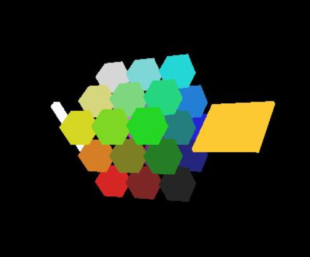
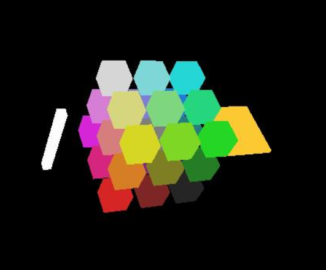

# AABB Rasterization from Gaussian Splat Input

The idea is that for each Gaussian point we render an AABB kernel. The implication:
- Cov3D dropped for tile counting and assignment. Inplace we tap the AABB vertices.
- Orthogonality assumption allows us to drop the rotation parameter
- Rendering kernel uses the SLAB test; no longer using Mahalanobis dist. func. 

The example below shows what happens when we feed the following Gaussian Splatting primitives:
- (Left) a long spikey gaussian
- (Center) a set of sphere gaussians
- (Right) a planar/disk gaussian.

  
  

<section class="section" id="BibTeX">
  

    <h2 class="title">Original 3D-GS BibTeX</h2>
    
This is a fork of the rasterization engine for the paper "3D Gaussian Splatting for Real-Time Rendering of Radiance Fields".

    <pre><code>@Article{kerbl3Dgaussians,
      author       = {Kerbl, Bernhard and Kopanas, Georgios and Leimk{\"u}hler, Thomas and Drettakis, George},
      title        = {3D Gaussian Splatting for Real-Time Radiance Field Rendering},
      journal      = {ACM Transactions on Graphics},
      number       = {4},
      volume       = {42},
      month        = {July},
      year         = {2023},
      url          = {https://repo-sam.inria.fr/fungraph/3d-gaussian-splatting/}
}</code></pre>
  

</section>